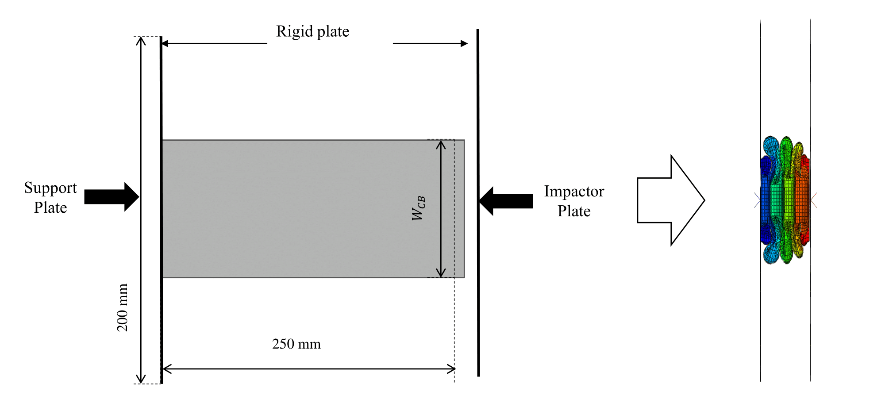
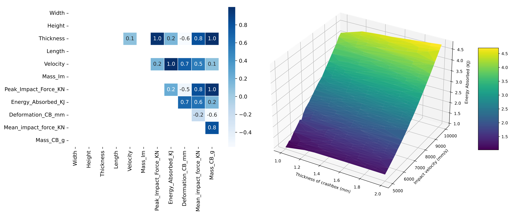

# Axial impact simulations of the crash box

This repository contains the database developed to be used in machine learning (ML) methods in the GAMM 23 [conference article](https://onlinelibrary.wiley.com/doi/full/10.1002/pamm.202300145).

The content of this repository can be used according to *License* .

---
### Investigating crash box for crashworthiness 

The crash box is one of the energy-absorbing structures in automobiles. Its deformation mechanism under frontal impact loading has already been comprehensively studied in various studies. Data from impact simulations performed in Simulia ABAQUS (version 2021) has been used to generate a simulation database for the ML framework, which can be found and accessed here. 



The MODELS_DATABASE_complete_TV contains different configurations of the crash box, along with their respective crashworthiness metric values. The configurations in the database have varying thicknesses and impact velocities while keeping other design parameters constant.

---
### Eigenmode analysis

Every structure contains some form of manufacturing or material impurities and this is often unknown. These impurities affect the structural behaviour. Therefore, numerical imperfection is manually added to simulate the realistic deformations of the crash box. To ensure the imperfection is not arbitrary, linear combinations of eigenmodes are used [1]. Therefore, initially, eigenmodes are investigated and used to define the numerical imperfection in the impact simulations.

Every structure has manufacturing or material impurities which are often difficult to identify. These impurities influence the structural behaviour. Therefore, to simulate realistic deformations of the crash box, numerical imperfection is inserted to crate imperfect structure. Linear combinations of eigenmodes are used to ensure that the imperfection is not arbitrary [1]. Initially, eigenmodes are explored and used to define the numerical imperfection in the impact simulations. The imperfection is defined as nodal displacement in the script to generate an impact simulation model and is 1% of the thickness of the crash box. These eigenmodes are saved in the file 'Eigen_Job-(ii-1)', where (ii-1) job ID.

```
    imperfection_scale = str(thickness*0.01)
    
    myModel.keywordBlock.synchVersions(storeNodesAndElements=False)
    myModel.keywordBlock.replace(80, 
    '\n** ----------------------------------------------------------------\n** \n*IMPERFECTION,FILE='+eigen_jobs[ii-1]+',STEP=1\n1,'+imperfection_scale+'\n** STEP: Impact_loading\n**')

```

The Python script '00_Script_new_eigen' generates the model database and 'random seed' controls the randomness of the model variables, namely random variation of thickness and impact velocity in their respective limit. This randomness includes variations of thickness and impact velocity within their respective limits according to seed number. The uploaded script is for seed(1) ( line no. 26) and the user can change them. 

Finally, the 'model_database_eigen_sims' CSV file is generated which contains all the design variables of the crash box and impactor for eigenmode analysis. The database contains the width, height, thickness and length of the crash box along with impact velocity and impactor mass as design variables. 

---
### Impact simulations

The Python script '00_Script_new_impact_sim_w_imperfection' generates the model database similar to eigenmode analysis and following the command inserts the corresponding imperfection in the crash box structure. Then, axial impact simulations are performed on the imperfect crash box. Similar to the Python script '00_Script_new_eigen', this script has a 'random seed' that controls the randomness of the model variables, namely random variation of thickness and impact velocity in their respective limit. The uploaded script is for seed(1) ( line no. 26) and the user can change them. 

The complete FEM model properties are described in the following table.

### FEM settings

| Properties | Values |
| ------------- | ------------- |
| Material | Density=2.7E-09 Young's Modulus=69000/ Poisson's ratio=0.33/ Plasticity table= 80 MPa - 0 and 173 MPa - 0.174 |
| Mesh | Size=0.2/ Elements=S4R |
| Simulation time  | 0.05 s  |
| Contact | Frictional coefficient=0.25/ normal "Hard" contact |
| Impact initial velocity  | As per configuration (listed in the database) |

At the end of the completion of the script, the 'model_database_dynamic_impact_sims' CSV file is generated which contains all the design variables (similar to 'model_database_eigen_sims') of the crash box and impactor. Also, the evolution of the output variables over time steps, energies, namely reaction forces and displacement, are saved in the file 'Dynamic_Job_ID_Energies_RF_U', where ID is job ID.

https://github.com/MrAdityaBorse/FEM_Data_Impact_Simulation/assets/157474877/64d79456-8197-4fdb-885b-b424bdd1a004


The final deformation pattern of Job-16 using seed(1) is shown in the figure and the above video shows the development of deformation.

---
### Data parsing 

The crashworthiness data is extracted from the simulation results using Python script '00_Data_parsing_to_figures'. This script extracts the crashworthiness metrics values and saves them in the file 'MODELS_DATABASE' in both CSV and Excel formats. This script also creates images of all the energies of the crash box and reaction force-deformation graphs to understand the deformation pattern.

---

### Steps

Thus, the steps to create the database is:

1. Conduct eigenmode analysis 
2. Impact simulations on the imperfect crash box
3. Data parsing to extract the crashworthiness metrics

---
### Database file

The file 'MODELS_DATABASE' is generated for every seed and then we can append them to create a complete database of various designs and their respective crashworthiness metric values. For this study, only seeds 1-5 are used and the combined database file is 'MODELS_DATABASE_complete_TV' generated. The database contains the width, height, thickness and length of the crash box along with impact velocity and impactor mass as design variables and initial peak contact force (IPCF), total energy absorbed, maximum deformed length of the crash box, mean contact force and mass of the crash box as crashworthiness metrics.

---
### Importing database

A sample script to import the database and analysis is uploaded with the name 'Loading database and analysing.ipnynb'. Sample data analysis is illustrated in the following image. The correlation matrix and crashworthiness metric (total energy absorbed) over differnt design parameters are shown, on the left and right respectively. Users can conduct similar data analysis to focus on the area of interest.



---
### Acknowledgement

The authors gratefully acknowledge the financial support provided by Deutsche Forschungsgemeinschaft Priority Programme: SPP 2353 (DFG Grant No. STO 469/16-1) for this investigation.

---
### References

1.  J. Arbocz. Post-buckling behaviour of structures numerical techniques for more complicated structures, pages 83–142. Springer Berlin Heidelberg, Berlin, Heidelberg, 1987.

---
