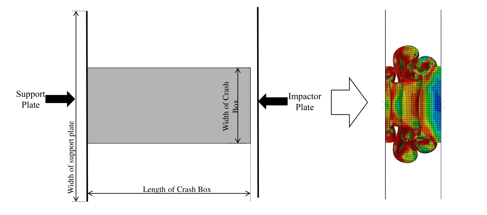

# Database of axial impact simulations of the crash box

Crashworthy design is a crucial part of vehicle development, and the simulations that must be performed are computationally intensive. Furthermore, multiple such simulations are performed to optimize parts. This repository has been created to provide the database of such simulations directly. With this database, various machine learning-based or conventional optimization methods could be implemented, and the design of the crash box could be optimized.

This repository contains the database of the FEM simulation results performed to be used in machine learning (ML) methods in the GAMM 23 [conference article](https://onlinelibrary.wiley.com/doi/full/10.1002/pamm.202300145) and [1]. The following description details how the database is generated and the variables' meanings. The user can independently use the provided database without the need to recreate one themselves for their optimization methods. 

The contents of this repository can be used according to the [MIT License](/LICENSE).

---
### Investigating crash box for crashworthiness 

The crash box is one of the energy-absorbing structures in automobiles. Various studies have already comprehensively studied its deformation mechanism under frontal impact loading. Data from impact simulations performed in Simulia ABAQUS (version 2021) has been used to generate a simulation database for the ML framework, which can be found and accessed here. 



The 'MODELS_DATABASE_complete_TV' contains different crash box configurations and their respective crashworthiness metric values. The configurations in the database vary in thickness and impact velocities while keeping other design parameters constant.

---
### Eigenmode analysis

Every structure contains some form of manufacturing or material impurities, which is often unknown. These impurities affect the structural behavior. Therefore, numerical imperfection is manually added to simulate the realistic deformations of the crash box. To ensure the imperfection is not arbitrary, linear combinations of eigenmodes are used [2]. Therefore, initially, eigenmodes are investigated and used to define the numerical imperfection in the impact simulations.

Every structure has manufacturing or material impurities which are often challenging to identify. These impurities influence structural behavior. Therefore, numerical imperfection is inserted to crate imperfect structure to simulate realistic deformations of the crash box. Linear combinations of eigenmodes ensure that the imperfection is not arbitrary [1]. Initially, eigenmodes are explored and used to define the numerical imperfection in the impact simulations. The imperfection is defined as nodal displacement in the script to generate an impact simulation model and is 1% of the thickness of the crash box. These eigenmodes are saved in the file 'Eigen_Job-(ii-1)', where (ii-1) is the job ID.

```
    imperfection_scale = str(thickness*0.01)
    
    myModel.keywordBlock.synchVersions(storeNodesAndElements=False)
    myModel.keywordBlock.replace(80, 
    '\n** ----------------------------------------------------------------\n** \n*IMPERFECTION,FILE='+eigen_jobs[ii-1]+',STEP=1\n1,'+imperfection_scale+'\n** STEP: Impact_loading\n**')

```

The Python script '00_Script_new_eigen' generates the model database, and 'random seed' controls the randomness of the model variables, namely the random variation of thickness and impact velocity within their respective limits. This randomness includes variations of thickness and impact velocity within their respective limits according to seed number. The uploaded script is for seed(1) ( line no. 26), and the user can change it. 

Finally, the 'model_database_eigen_sims' CSV file is generated, which contains all the design variables of the crash box and impactor for eigenmode analysis. The database includes the crash box's width, height, thickness, and length, along with impact velocity and impactor mass as design variables. 

---
### Impact simulations

The Python script '00_Script_new_impact_sim_w_imperfection' generates the model database similar to eigenmode analysis and, following the command, inserts the corresponding imperfection in the crash box structure. Then, axial impact simulations are performed on the imperfect crash box. Similar to the Python script '00_Script_new_eigen', this script has a 'random seed' that controls the randomness of the model variables, namely random variation of thickness and impact velocity in their respective limit. The uploaded script is for seed(1) ( line no. 26); the user can change them. 

The complete FEM model properties are described in the following table.

### FEM settings

| Properties | Values |
| ------------- | ------------- |
| Material | Density=2.7E-09 Young's Modulus=69000/ Poisson's ratio=0.33/ Plasticity table= 80 MPa - 0 and 173 MPa - 0.174 |
| Mesh | Size=0.2/ Elements=S4R |
| Simulation time  | 0.05 s  |
| Contact | Frictional coefficient=0.25/ normal "Hard" contact |
| Impact initial velocity  | As per configuration (listed in the database) |

At the end of the script's completion, the 'model_database_dynamic_impact_sims' CSV file is generated, which contains all the design variables (similar to 'model_database_eigen_sims') of the crash box and impactor. Also, the evolution of the output variables over time steps, energies, namely reaction forces and displacement, are saved in the file 'Dynamic_Job_ID_Energies_RF_U,' where ID is job ID.

https://github.com/MrAdityaBorse/FEM_Data_Impact_Simulation/assets/157474877/64d79456-8197-4fdb-885b-b424bdd1a004


The final deformation pattern of Job-16 using seed(1) is shown in the figure, and the video above shows the development of deformation.

---
### Data parsing 

The crashworthiness data is extracted from the simulation results using Python script '00_Data_parsing_to_figures'. This script extracts the crashworthiness metrics values and saves them in the file 'MODELS_DATABASE' in both CSV and Excel formats. This script also creates images of all the energies of the crash box and reaction force-deformation graphs to understand the deformation pattern.

---

### Steps

Thus, the steps to create the database is:

1. Conduct eigenmode analysis 
2. Impact simulations on the imperfect crash box
3. Data parsing to extract the crashworthiness metrics

---
### Database file

The file 'MODELS_DATABASE' is generated for every seed, and then we can append them to create a complete database of various designs and their respective crashworthiness metric values. For this study, only seeds 1-5 are used, and the combined database file generated is 'MODELS_DATABASE_complete_TV'. The database contains the width, height, thickness, and length of the crash box along with impact velocity and impactor mass as design variables and initial peak contact force (IPCF), total energy absorbed, maximum deformed length of the crash box, mean contact force and mass of the crash box as crashworthiness metrics.

---
### Importing database

A sample script to import the database and analysis is provided with the name 'Loading database and analysing.ipynb'. Sample data analysis is also illustrated in the following image. The correlation matrix and crashworthiness metric (total energy absorbed) over crash box design parameters are described in the following image on the left and right. Users can conduct similar data analysis to focus on the area of interest.


For example, if the critical objectives are the maximum deformed length and total energy absorbed, the following (right) graph can be obtained. The red points denote the Pareto front solutions. These points denote the non-dominated solutions where both objectives have equal importance. This kind of analysis could be performed on the objectives to understand the correlation between the crashworthiness objectives. Thereby, the optimization process and the inequality constraints of the crashworthiness objectives could be determined to formulate the complete optimization problem.

<p align="center">

</p>

---
### Acknowledgement

The authors gratefully acknowledge the financial support provided by Deutsche Forschungsgemeinschaft Priority Programme: SPP 2353 (DFG Grant No. STO 469/16-1) for this research.

---
### References

1.  A. Borse, R. Gulakala, M. Stoffel, Development of a machine learning-based design optimization method for crashworthiness analysis, Archives of Mechanics 76 (1-2), DOI: 10.24423/aom.4454, 2024.
2.  J. Arbocz. Post-buckling behavior of structures numerical techniques for more complicated structures, pages 83–142. Springer Berlin Heidelberg, Berlin, Heidelberg, 1987.
   
---
